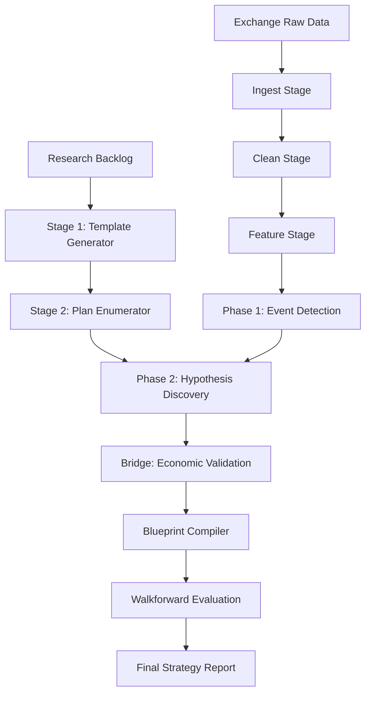

# Architecture Guide

The Backtest platform is built as a **Subprocess-driven Orchestrator**. The primary entry point is `project/pipelines/run_all.py`, which coordinates a series of independent Python stages.

## 🗺️ Data Flow Map

## 🏗️ Core Components

### 1. The Orchestrator (`run_all.py`)

Manages dependencies between stages. Each stage is an independent Python script that reads inputs from the `data/lake` and writes artifacts to `data/reports`.

### 2. Atlas-Driven Planning

The research queue is now deterministic and driven by the Knowledge Atlas:

- **Global Planner (`generate_candidate_templates.py`)**: Translates claims from the backlog into stable templates. It also outputs a `spec_tasks.parquet` to track missing specifications.
- **Run Enumerator (`generate_candidate_plan.py`)**: Expands templates across symbols and applies strict budgets. It produces a hashable `candidate_plan.jsonl` and a **Feasibility Report**.

### 3. Execution Timeframe

All backtest stages accept `--timeframe` (default `5m`); `run_all.py` accepts `--backtest_timeframe`. The engine maps this to `BARS_PER_YEAR` for correct Sharpe annualization. **All data lake paths use `5m`** — do not pass `15m` unless you have 15m OHLCV data ingested separately.

### 4. The Data Lake (`data/lake/`)

Organized by market type, symbol, and timeframe.

- `raw/`: Unmodified OHLCV, funding, and OI data.
- `cleaned/`: Normalized data with gaps filled and UTC timestamps aligned.
- `features/`: High-level PIT indicators (e.g., volatility z-scores, Amihud ratio).

### 5. The Spec System (`spec/`)

This is the "Source of Truth" for the entire platform. If logic isn't in a Spec, it isn't used in production.

- `concepts/`: High-level trading ideas.
- `features/`: Mathematical definitions of indicators.
- `events/`: Detection thresholds for market regimes.
- `gates.yaml`: Hard thresholds for pass/fail criteria (e.g., `min_ess`, `max_q_value`).

### 6. The Execution Engine (`project/engine/`)

A high-performance event-driven runner.

- **P&L Calculator**: Tracks position-weighted returns, including funding and borrow costs.
- **Risk Allocator**: Enforces gross leverage and symbol-level risk budgets.
- **Fills Model**: Simulates market-impact-adjusted execution.

### 7. Strategy DSL (`project/strategy_dsl/`)

Translates discovered edges into executable code.

- **Schema**: Strictly typed dataclasses for Blueprints.
- **Policies**: Event-specific defaults for entry/exit behavior.
- **Interpreter**: Executes the logic nodes defined in a blueprint against a feature stream.

## 🛡️ Invariants and Enforcement

The platform enforces safety at every stage:

- **Cost Config Digest**: A unique hash of the fee/slippage settings. Every blueprint is "bound" to a specific cost digest to prevent validating a strategy under cheaper costs than it was discovered with.
- **Certification Baseline**: The `golden/` directory contains artifacts from a known-good "Certification Batch". Tests automatically compare current runs against this baseline to detect regressions.
