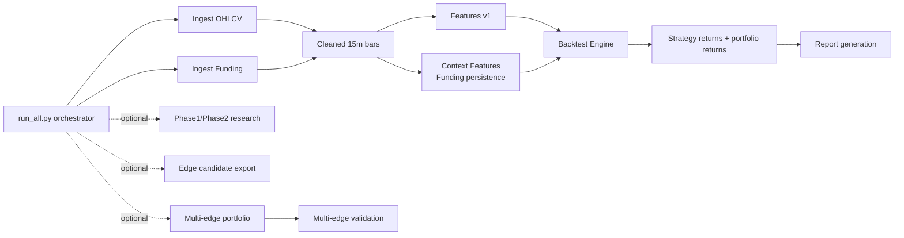

# Backtest Architecture Diagram

This document provides a concise stage and artifact view of the repository architecture.

## Primary artifact roots
- Raw ingest: `data/lake/raw/binance/perp/<symbol>/...`
- Run-scoped clean/features/context: `data/lake/runs/<run_id>/...`
- Backtest outputs: `data/lake/trades/backtests/.../<run_id>/...`
- Stage manifests/logs: `data/runs/<run_id>/<stage>.json|.log`
- Reports: `data/reports/.../<run_id>/...`

## Core code mapping
- Orchestrator: `project/pipelines/run_all.py`
- Ingest/Clean/Features: `project/pipelines/ingest`, `project/pipelines/clean`, `project/pipelines/features`
- Engine: `project/engine/runner.py`, `project/engine/pnl.py`
- Strategies: `project/strategies/*.py`
- Portfolio allocator: `project/portfolio/multi_edge_allocator.py`
