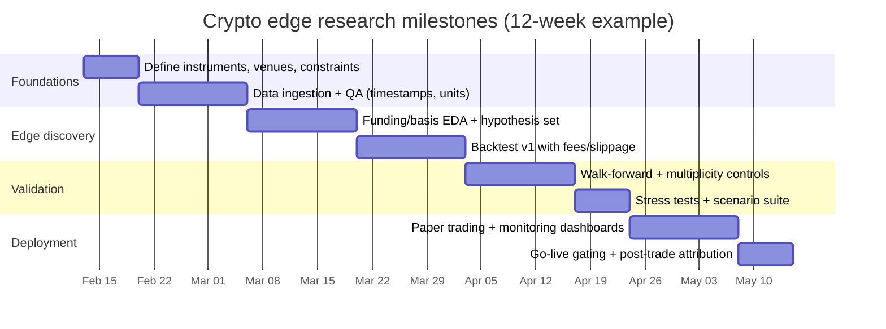

# Discovering Trading Edges and Building Crypto Strategies in 2026

## Executive summary

A “trading edge” in crypto is a repeatable, **net-of-costs** expected return (or risk reduction) that persists **out of sample** after accounting for **data-snooping / multiple testing**, **non-stationarity**, and **market microstructure frictions**. The main practical implication is that you should treat “alpha discovery” as an engineering pipeline that converts noisy hypotheses into *deployable* signals through aggressive validation, adversarial testing, and execution-aware modelling. citeturn7search7turn7search6turn8search7turn9search3

In crypto specifically, the highest “signal-to-effort” edge families (inference based on publicly documented mechanics and commonly available datasets) tend to be:

- **Derivatives carry / basis / funding** because the mechanisms are explicit (funding transfers between longs/shorts; futures basis definition; open interest reporting) and the data is broadly accessible from exchanges and major vendors. Capacity and tail risk still matter. citeturn33view0turn32view0turn22view3turn32view2  
- **Cross-venue / cross-instrument convergence and structural frictions** (spot–perp, stablecoin pairs, fee schedules, maker/taker rebates) because the “why” is mechanical, but the “how” is execution- and ops-heavy. citeturn29view3turn31view2turn30view3turn33view3  
- **Order-book / order-flow microstructure** (order book imbalance, liquidity/impact asymmetries) can be statistically strong at short horizons, but it is extremely sensitive to data quality, queue position, and cost modelling; it is usually dominated by latency/execution quality. citeturn9search3turn28view2turn22view2turn8search7  
- **On-chain flow/positioning** (exchange netflows, entity-adjusted metrics) can add medium-horizon explanatory power, but address labelling and metric mutability create “revision risk” that must be explicitly handled. citeturn13search4turn13search6turn23view1  

A rigorous research process in this domain must (i) split data in a time-respecting way, (ii) correct for multiple testing, and (iii) incorporate realistic costs and market impact. citeturn8search0turn7search7turn8search7

## Edge taxonomy and edge characteristics

The taxonomy below is designed to be *operational*: each edge type is defined by **its information source**, typical **signal construction**, **horizon**, and **dominant failure modes**.

### Edge-type classification matrix

| Edge family | Rationale (why it can exist) | Typical signal construction (how) | Typical horizon / holding period | Risk characteristics | Common pitfalls |
|---|---|---|---|---|---|
| **Trend / momentum (price-based)** | Crypto exhibits regimes where returns are serially correlated at some horizons (documented empirically in multiple studies; results vary by asset & period). citeturn9search20turn9search15 | Time-series momentum: sign(rolling return). Cross-sectional momentum: rank assets by past return and long top / short bottom. Features: multi-horizon returns, breakout distance, realised volatility filters. citeturn9search20turn9search15 | Hours → weeks (holding from 1–2 bars to multi-day). | “Momentum crash” risk: sharp reversals; convex drawdowns; correlation spikes across alts. (Inference, consistent with momentum literature; crypto-specific behaviour is regime-dependent.) citeturn9search20turn9search15 | Look-ahead bias (bar alignment), survivorship (tokens), unstable liquidity, ignoring costs/impact. citeturn8search0turn8search7 |
| **Mean reversion (price-based)** | Microstructure + inventory/flow imbalances can revert at short horizons; crypto also shows reversal patterns intraday in some studies. citeturn9search20turn9search3 | Z-score of returns vs rolling mean; distance to VWAP; RSI-type transforms; liquidity/volatility conditioned contrarian trades. citeturn9search20turn9search3 | Seconds → hours (scalps to intraday). | Execution risk dominates; adverse selection; sharp continuation moves. citeturn8search7turn9search3 | Overfitting thresholds; underestimating spread/slippage; trading into news/liquidations. citeturn8search7turn7search7 |
| **Order-book imbalance / order-flow (microstructure)** | Order-flow imbalance is empirically linked to short-term price changes; depth conditions the slope (market impact / liquidity). citeturn9search3turn9search1 | OFI (order flow imbalance), volume imbalance at top N levels, queue pressure metrics, microprice, short-horizon imbalance + volatility filter. citeturn9search3turn22view2turn28view2 | 100ms → minutes (rarely > 1 hour). | Highly path-dependent PnL; latency/queue position critical; regime shifts when market makers adapt. citeturn9search3turn28view2 | “Phantom liquidity”/cancellations; hidden order types (example: some exchanges exclude certain RPI orders from book responses). citeturn28view1turn28view2turn9search3 |
| **Fee / rebate / market-structure arbitrage** | Maker/taker schedules and incentive programs create predictable frictions; rebates can change effective spread if you can post and get filled. citeturn31view2turn29view3turn30view3turn33view3 | Optimise venue + order type + post-only logic; rebate capture models; cost-aware routing; internal “effective fee” estimator by tier. citeturn29view3turn33view3turn30view3 | Seconds → days (depends on strategy). | Operational + counterparty risk; discontinuous changes when tiers reset; fill probability uncertainty. citeturn33view3turn29view3 | Backtests assume fills at mid; ignore partial fills; ignore tier dynamics and eligibility constraints. citeturn29view3turn33view3 |
| **Latency / propagation edges** | Faster access to state (mempool, book, trades) can capture fleeting opportunities. Some providers explicitly market latency advantages vs running your own node. citeturn34view0turn34view2turn28view2 | React faster to triggers (mempool tx, book shocks, liquidation prints). Typically paired with strict risk caps and kill-switches. citeturn34view0turn28view2 | Milliseconds → seconds. | Infrastructure risk; adversarial competition; edge decays fastest. (Inference) citeturn34view0turn28view2 | Measuring “latency” incorrectly; timestamps not comparable; co-location illusions; ignoring exchange throttles. citeturn27view2turn28view1 |
| **On-chain metrics (informational)** | Public ledgers expose transfers, contract events, and (sometimes) entity-labelled flows that can proxy positioning and supply/demand. Exchange flow metrics rely on labelled addresses and can be revised. citeturn22view0turn13search4turn13search6 | Examples: exchange netflow, exchange balances, entity growth; valuation ratios like MVRV; protocol-specific event features (mints/burns, staking). citeturn13search4turn13search1turn22view0 | Hours → months. | Regime dependence; signal latency; “metric revision risk” when labels/heuristics update. citeturn13search4turn13search6 | Confusing causality; mixing chains/assets; ignoring that some exchanges are hard to measure on-chain (address behaviour). citeturn15search12turn13search6 |
| **Social sentiment / attention** | Attention can lead flows in reflexive markets; but it is noisy, and subject to manipulation and API constraints. citeturn36view3turn36view2 | Features: post counts, sentiment scoring, influencer graph, topic clusters; event studies; anomaly detection on volume of mentions. citeturn36view3turn36view2 | Minutes → days. | High false-positive rate; vulnerability to brigading/data poisoning. (Inference) citeturn36view3turn36view2 | Sampling bias (API tiers), survivorship of accounts; mixing bots + humans; overfitting language models. citeturn36view3turn36view2 |
| **Developer activity** | Code changes/releases can be leading indicators for some ecosystems; also proxies for project health. Data is accessible but mapping repos→tokens is messy. (Inference; mechanics of data access are documented.) citeturn4search11 | Features: commits/releases/issues velocity; contributor concentration; dependency graph; “release event” studies. citeturn4search11 | Days → months. | Weak direct linkage to returns; effects depend on narrative cycles. (Inference) citeturn4search11 | Repo mapping errors; forks; private repos; fake activity. (Inference) citeturn4search11 |
| **Derivatives basis & funding (alternative / structural)** | Perpetuals use funding to align with spot; futures basis is a defined differential that can persist with constraints and risk premia. Open interest reflects positioning and can shift around stress. citeturn33view0turn32view0turn22view3turn32view2 | Signals: funding spread across venues; predicted vs realised funding; annualised basis by tenor; basis momentum/mean-reversion; OI shocks + liquidation cascades. citeturn32view1turn22view3turn32view2turn32view3 | Minutes → months (carry often multi-day to multi-week). | Tail risk in squeezes and liquidation cascades; cross-venue margin/custody risk. citeturn33view0turn32view3 | Treating funding as “free yield”; ignoring borrow/custody constraints; ignoring execution costs. citeturn33view2turn8search7 |
| **MEV / mempool (alternative)** | Transaction ordering can create extractable value; MEV has been documented to create competitive auctions and systemic risks. citeturn35view2turn35view0turn35view1 | Detection (safer research): classify sandwiches/backruns; monitor private orderflow systems; measure MEV intensity and its impact on DEX prices/liquidity. citeturn35view1turn34view2 | Sub-second → minutes. | Adversarial domain; legal/ethical constraints; extreme competition. citeturn35view2turn35view0 | Using public mempool alone (missing private flow); mislabelling MEV; timestamp misalignment. (Inference) citeturn35view3turn34view2 |
| **OTC flows / “smart money” labels (alternative)** | True OTC prints are mostly off-exchange/off-public; practitioners use labelled wallets/entities and large-flow heuristics as proxies. Accessibility varies by vendor. (Inference) citeturn23view2turn36view1 | Signals: labelled wallet flows, token holder concentration changes; entity clustering; “whale” accumulation events with confirmation rules. citeturn23view2turn13search22 | Hours → weeks. | Label quality risk; selection bias; vendor dependence. citeturn23view1turn13search6 | Treating labels as ground truth; ignoring metric mutability and exchange address behaviour. citeturn13search4turn13search6 |

image_group{"layout":"carousel","aspect_ratio":"16:9","query":["crypto perpetual funding rate chart","crypto order book heatmap visualization","on-chain analytics dashboard exchange netflow","MEV sandwich attack diagram"],"num_per_query":1}

## Data landscape and dataset economics

Crypto research is unusually data-intensive because (i) markets trade 24/7, (ii) microstructure signals require high-frequency updates, and (iii) “fundamentals” are often proxied via on-chain and derivatives positioning data. A practical dataset plan should prioritise: **(a) clean timestamps**, **(b) coverage continuity**, **(c) explicit data-generating mechanisms**, and **(d) a cost model you can sustain**. citeturn28view0turn26view0turn32view2turn8search7

### Dataset/vendor reference tables

**On-chain and indexing sources**

| Provider / dataset | Key fields (examples) | Frequency / latency | Access & cost | Quality issues to model explicitly |
|---|---|---|---|---|
| entity["company","Etherscan","ethereum block explorer api"] API (txlist, logs) | Normal tx list includes `blockNumber`, `timeStamp`, `hash`, `from`, `to`, `value`, `gas`, `gasPrice`, `input`, `methodId`, `functionName`, etc. Event logs include `address`, `topics[]`, etc. citeturn21view0turn22view0 | Block-level; API pagination; topic-based log queries. citeturn22view0turn22view1 | API key; tiered pricing / rate limits (free tier has call/sec and daily limits; paid tiers increase caps). citeturn23view0 | Reorgs (rare but real), missed internal state unless you model it; request limits; requires correct ABI/topic decoding. (Inference) citeturn22view1turn21view0 |
| entity["company","Dune","blockchain sql analytics platform"] queries + API | Execute query returns `execution_id`; query parameters supported; results retrievable via API; multiple “performance tiers”. citeturn21view3turn19search6 | Depends on query + engine; typically minutes for heavy joins. citeturn21view3 | Usage-based “credits”; free plan (documented as 2,500 credits/month); billing by compute and exports. citeturn24view3turn24view0 | Query cost variability; schema changes; backfills; SQL logic becomes part of your model risk. citeturn24view0turn24view2 |
| entity["organization","The Graph","decentralized indexing protocol"] (Subgraph Studio / Network) | GraphQL query results from subgraphs; billing via query fees; API keys with cost/spend limits. citeturn20search0turn20search3turn20search1 | Near-real-time indexing depending on subgraph/indexer. (Inference) citeturn20search1turn20search0 | Pricing: free monthly queries + usage-based ($2 per 100k queries stated for Studio pricing). citeturn23view3turn20search0 | Subgraph schema/version drift; indexing lag; “what is indexed” differs by subgraph curator. (Inference) citeturn20search2turn20search3 |
| entity["company","Glassnode","on-chain analytics firm"] metrics API | Exchange netflow and exchange balances are defined on labelled exchange addresses; MVRV ratio defined as market cap vs realised cap. citeturn13search4turn13search10turn13search1 | Often hourly/daily for many metrics; depends on endpoint. (Inference) citeturn13search12 | API credit model: “each call typically consumes one credit” with bulk endpoint rules. citeturn23view1 | **Metric mutability**: labelled exchange metrics can shift as labels update; revisions can affect latest datapoints. citeturn13search4turn13search6 |
| entity["company","Nansen","on-chain analytics and wallet labels"] API | “Smart Money flows” and proprietary endpoints (as marketed); credit-based usage with pay-as-you-go. citeturn23view2 | Typically near-real-time for labelled flows (vendor-specific). (Inference) citeturn23view2 | Pricing model states per-credit cost ($0.001 per API credit shown) and free/pro tiers with credit allotments. citeturn23view2 | Label/coverage opacity; vendor lock-in; survivorship bias in “smart money” sets. (Inference) citeturn23view2 |
| entity["company","Chainalysis","blockchain analytics and compliance"] sanctions screening API | “Check if an address is sanctioned” type endpoints; requires API key; documented rate limit (5000 requests/5 minutes). citeturn36view1 | API latency typical of SaaS. (Inference) citeturn36view1 | Sign-up required; enterprise pricing not fully public (often sales-led). (Inference) citeturn36view1 | Not a direct “alpha” dataset; compliance/taint signals can create tradability constraints. (Inference) citeturn36view1 |

**Exchange market data sources (spot & derivatives)**

| Provider / dataset | Key fields (examples) | Frequency / latency | Access & cost | Quality issues to model explicitly |
|---|---|---|---|---|
| entity["company","Binance","crypto exchange"] APIs + public data dumps | Spot aggTrades REST returns price/qty/timestamp style fields; WebSocket depth updates can be 100ms; futures depth streams include 100–500ms options; some RPI orders excluded from order book responses; public data site provides daily/monthly files (aggTrades, trades, klines) and notes timestamp units change (microseconds from 2025 for spot data per repo). citeturn21view2turn22view2turn28view2turn28view1turn28view0 | 100ms–1s WS updates; daily/monthly historical files. citeturn22view2turn28view0 | Market data largely public; fee schedule (maker/taker tiers) published. citeturn31view2turn28view0 | Hidden/excluded order types; timestamp unit shifts; throttling/weights; maintenance gaps. citeturn28view1turn28view0turn28view2 |
| entity["company","Coinbase","crypto exchange and broker"] Exchange WebSocket & REST | WebSocket feed is public for market data; “direct” feed requires auth; product book endpoint supports L1/L2/L3 with guidance to use WS for real-time and to avoid polling L3; connectivity includes REST, FIX order entry, and FIX market data. citeturn29view0turn29view1turn29view2 | Real-time WS; REST intended lower frequency. citeturn29view1turn29view2 | Maker/taker fee tiers documented; stablepair fee notes exist. citeturn29view3 | Auction modes, book state transitions; rate limits; differing timestamps across feeds. (Inference) citeturn29view1turn29view0 |
| entity["company","Deribit","crypto derivatives exchange"] API | `public/get_funding_rate_history` returns hourly funding history for PERPETUALs; `public/get_book_summary_by_currency` provides open interest, bid/ask, mark price, volume etc; docs note WS alternatives for real-time. citeturn30view0turn30view2 | Hourly funding history; WS for real-time. citeturn30view0turn30view2 | Fee model and example fees documented (maker/taker; fees vary by product). citeturn30view3 | Contract spec nuances; settlement conventions; liquidation/insurance rules; API schema changes. (Inference) citeturn30view2turn30view3 |
| entity["company","BitMEX","crypto derivatives exchange"] API + fee schedules | API explorer exists; fee pages show maker/taker discounts and examples; institutional fee calculations published. citeturn16search3turn31view1 | Real-time WS + REST; (detail depends on endpoint). citeturn16search3 | Fees and rebates can be negative for maker for some tiers (example shown). citeturn31view1 | JS-heavy docs; evolving endpoints; symbol mappings. (Inference) citeturn16search21turn31view1 |
| entity["company","FTX","defunct crypto exchange"] archival (via vendors) | Historical coverage may exist via third-party vendors and research datasets; Coin Metrics basis documentation explicitly references exchange-assets like `ftx-eth` in its basis calculations. citeturn22view3 | Historical only. | No longer a live feed; exchange failed (bankruptcy filing date documented). citeturn11search3 | Survivorship bias; symbol discontinuities; missing microstructure fields. (Inference) citeturn11search3turn22view3 |
| Coin Metrics MDF / community | Market data endpoints include trades, order books, funding rates, open interest, liquidations (as described). Open interest collected at one-minute snapshots (with exchange-specific update caveats). Predicted funding sampled once per minute; realised funding typically updates per interval (often 8h). citeturn25view1turn32view2turn32view1turn32view0 | 1m snapshots for many metrics; varies by exchange; includes `database_time` field guidance. citeturn32view2turn25view0 | Community API free for non-commercial, no key; rate limits documented; paid tier via API key. citeturn25view0turn25view1 | “Exchange-reported time” vs “query time”; heterogeneous update frequencies (e.g., open interest update frequency differs). citeturn32view2turn32view1 |
| entity["company","Kaiko","crypto market data vendor"] tick data & L2 | Tick-level “all trades” includes `id`, `price`, `amount`, exchange slug, timestamp; L2 “raw order book snapshot” produced every 30 seconds with `type` bid/ask, `price`, `amount`; “bids and asks” dataset provides snapshots/updates with `[price, volume]` lists and notes timestamp availability differs by exchange. citeturn26view0turn26view1turn26view3turn12search7 | Tick-level; snapshots every 30s (raw snapshot); real-time via streams. citeturn26view1turn26view3 | Typically paid; delivery via CSV, stream, and marketplaces (sales-led). citeturn12search3turn26view0 | Timestamp provenance differences; normalisation choices; exchange timestamp missing for some venues. citeturn26view3turn26view0 |
| entity["company","CoinAPI","crypto market data api vendor"] order book & replay | REST order book has request-cost semantics; docs describe merging quotes with book for fast updates; WS “book” message includes snapshot/update flags, sequence, exchange & CoinAPI times; billing headers and per-100 datapoint charging concepts documented. citeturn27view0turn27view1turn27view2 | Real-time WS; REST for snapshots/historical (depends on plan). citeturn27view1turn27view0 | Free key available; paid tiers with quotas; headers expose limits and concurrency. citeturn27view2 | “Quote-size unknown” behaviour; exchange coverage variability; replay correctness depends on full L2/L3 coverage. citeturn27view0turn27view1 |

**Social / developer data sources**

| Source | Key fields | Frequency / latency | Cost & access | Quality issues |
|---|---|---|---|---|
| entity["company","X","social media platform"] API | Rate limit headers; recent search endpoint limits; “rate limits vs billing” distinction explained. citeturn36view3 | Near-real-time depending on endpoint. | API tiers; billing separate from rate limits. citeturn36view3 | Strong bot/manipulation surface; sampling biases by tier. (Inference) citeturn36view3 |
| entity["company","Reddit","social media platform"] Data API | Free access rate limits documented (100 queries/min per OAuth client id); requirements around deletion handling/retention. citeturn36view2 | Near-real-time. | OAuth; rate-limited. citeturn36view2 | Policy compliance constraints (deletion); brigading and coordinated campaigns. (Inference) citeturn36view2 |
| entity["company","Telegram","messaging platform"] Bot API | Bot polling/webhooks; standard message/event primitives (documented). citeturn4search10 | Real-time-ish. | Free; operational overhead. (Inference) citeturn4search10 | Hard-to-normalise chat context; spam; partial observability (private groups). (Inference) citeturn4search10 |
| entity["company","GitHub","code hosting platform"] API | Rate limit concepts documented; used to observe repos, commits, releases. citeturn4search11 | Near-real-time. | OAuth / tokens; rate limited. citeturn4search11 | Repo-token mapping error; fork noise; private repos. (Inference) citeturn4search11 |

**MEV / mempool / propagation sources**

| Source | What you can measure | Frequency | Cost & access | Quality issues |
|---|---|---|---|---|
| entity["organization","Flashbots","mev research and development organization"] ecosystem | MEV context, MEV-Share (orderflow auction) and Protect RPC; docs describe purpose and mechanics. citeturn35view0turn35view1turn35view3 | Real-time for RPC interactions. | Public docs; usage depends on integration. citeturn35view3turn35view1 | Public mempool incompleteness vs private flow; builders/relays change. (Inference) citeturn35view3 |
| entity["company","bloXroute","blockchain distribution network"] BDN / APIs | Docs claim mempool speed advantages (up to ~1000ms faster than own node mempool) and private transaction functionality (privacy not guaranteed). citeturn34view0turn34view2 | Sub-second. | Tiered; private tx marketed as available across tiers (doc notes). citeturn34view2turn34view0 | Marketing benchmarks vs your conditions; privacy caveats; data access terms. citeturn34view2turn34view0 |
| Mempool open-source project | Open-source explorer/API service; backend described; (some API docs pages are JS-heavy, but project identity is documented). citeturn38view0turn39view0 | Real-time-ish. | Open-source; enterprise offering exists (details may be JS-heavy). citeturn38view0turn39view0 | Endpoint documentation accessibility; third-party wrappers list endpoints (treat as supportive, not canonical). citeturn39view1turn39view0 |

### Prioritised “best edge sources” by expected signal quality × ease of access

This ranking is an **inference** that balances (a) explicitness of the economic mechanism, (b) dataset accessibility, and (c) typical cost/complexity. It is not a guarantee of profitability.

1. **Funding rates & funding spreads across venues** (mechanism documented; data widely accessible). citeturn33view0turn32view0turn30view0  
2. **Futures basis / carry by tenor + spot–futures convergence** (definition and frequencies available via major vendors). citeturn22view3turn32view2  
3. **Liquidation & open-interest shocks as regime filters** (open interest snapshot frequency and liquidation endpoints documented by vendors). citeturn32view2turn32view3  
4. **Cross-exchange fee/ rebate surfaces** (fees are published; the “edge” is execution + routing). citeturn31view2turn29view3turn30view3turn33view3  
5. **Exchange netflow / exchange balance dynamics** as medium-horizon risk-on/risk-off filters (but revision risk must be modelled). citeturn13search4turn13search6  
6. **Order-book imbalance** (statistical link is strong in microstructure literature; implementation hard). citeturn9search3turn28view2turn22view2  
7. **Time-series momentum / intraday reversal** (accessible; but crowded and regime-sensitive). citeturn9search20turn9search15  
8. **Social attention/sentiment** (cheap but noisy and manipulable; API constraints). citeturn36view3turn36view2  
9. **Developer activity** (cheap; mapping + weak direct linkage are the main issues). citeturn4search11  
10. **MEV/mempool intensity signals** (deep, adversarial, and operationally heavy; best treated first as a *risk* and *structure* signal). citeturn35view2turn35view1turn34view2  

## Methodology for discovering edges and validating them rigorously

A robust workflow must treat “edge discovery” as a **hypothesis testing problem under multiplicity**, with careful attention to time-series leakage and non-stationarity.

### Core research workflow

**Step 1: Define the trading game precisely**  
Universe, venue(s), instrument types (spot/perp/options), constraints (leverage, borrow, custody), and *how PnL is actually realised* (funding transfers, fees, slippage, rebates). Funding and fee mechanics are venue-specific and explicitly documented for many major exchanges. citeturn33view0turn29view3turn30view3turn31view2  

**Step 2: Data audit before modelling**  
You cannot correct later for missing timestamps, inconsistent timezones, unit changes, or hidden/excluded liquidity. Examples: timestamp unit changes in archival exchange exports; exclusions of specific order types from API order books; and vendor warnings that exchange-labelled on-chain metrics can be mutable. citeturn28view0turn28view1turn13search4turn13search6  

**Step 3: Exploratory data analysis (EDA) with “leakage paranoia”**  
- Align bars correctly (close-to-close vs open-to-close).  
- Ensure features do not use future information (e.g., “daily high” before the day ends).  
- Use time-series aware splits for preliminary evaluation. citeturn8search0turn8search7  

**Step 4: Feature engineering with structural grounding**  
Prefer features tied to a documented mechanism: funding (payments between longs/shorts), basis definition, open interest snapshots, order book update streams. citeturn33view0turn22view3turn32view2turn28view2  

**Step 5: Backtesting with realistic costs and impact**  
Use models of transaction costs and market impact; the execution literature formalises optimal execution under temporary/permanent impact and risk. citeturn8search7turn8search3turn9search1  

**Step 6: Statistical significance under multiple testing**  
If you test many variants, at least one will look good by chance. Use methods such as **White’s reality check** for data snooping and selection-bias-aware performance metrics (e.g., deflated Sharpe ratio ideas). citeturn7search7turn7search6turn7search9  

**Step 7: Walk-forward / out-of-sample / stress and adversarial checks**  
- Walk-forward evaluation is mandatory for non-stationary markets.  
- Include adversarial tests: flipped regime, widened spreads, delayed signals, partial outages, fee changes. citeturn8search0turn31view2turn29view3  

### Mermaid flowchart for the research workflow

```mermaid
flowchart TD
  A[Define trading objective & constraints] --> B[Acquire datasets]
  B --> C[Data QA: timestamps, units, survivorship, gaps]
  C --> D[EDA + hypothesis generation]
  D --> E[Feature engineering (mechanism-based)]
  E --> F[Backtest engine (costs, slippage, funding)]
  F --> G[Time-series validation: walk-forward / CV]
  G --> H[Multiplicity control: reality check / DSR]
  H --> I[Robustness: stress, adversarial, scenario tests]
  I --> J[Paper trading / shadow execution]
  J --> K[Production deployment + monitoring]
  K --> L[Post-trade attribution + model governance]
  L --> D
```

### Tools and storage stack recommendations

- **Python-first research stack** with vectorised backtesting when scanning many variants; e.g., vectorised engines that operate on pandas/NumPy objects are explicitly designed for high-throughput strategy evaluation. citeturn14search2turn14search16  
- **Event-driven backtesting** when you need realistic order simulation and execution logic (latency, partial fills). citeturn14search3turn18search2  
- **Time-series / tick storage**: column-oriented analytical databases and time-series columnar systems are designed for large-scale query workloads. citeturn14search7turn14search1  
- **Exchange connectivity / execution plumbing**: open-source connector frameworks exist for crypto trading bots and exchange integration (useful as reference architectures even if you build in-house). citeturn18search1turn18search0  

## Strategy construction, execution, and live operations

In crypto, many “good backtests” fail at deployment because sizing and execution are treated as afterthoughts. The construction layer should be designed together with the edge.

### Portfolio sizing and risk budgeting

A practical sizing framework is to separate:

1. **Edge strength estimate** (expected return conditional on signal).  
2. **Risk model** (volatility, drawdown, tail risk) and the risk measure used (e.g., expected shortfall is a standard tail-risk measure in banking regulation). citeturn17search3  
3. **Capital allocation rule**:  
   - Mean–variance intuition traces back to entity["people","Harry Markowitz","economist portfolio theory"]’s portfolio selection framework (expected return vs variance and covariance). citeturn17search8turn17search4  
   - Growth-optimal sizing originates from entity["people","J. L. Kelly Jr.","scientist kelly criterion"]’s information-rate result (often adapted as fractional-Kelly in trading). citeturn17search1turn17search5  

In crypto practice, you usually need **leverage-aware** and **liquidity-aware** caps: position size ÷ expected depth and “max loss under liquidation cascade” scenarios.

### Transaction-cost modelling (TCM) and market impact

At minimum, model:

- **Explicit fees**: maker/taker and tier schedules can materially change net returns and can include rebates. citeturn29view3turn31view2turn30view3turn33view3  
- **Spread + slippage**: for microstructure edges, slippage typically dominates.  
- **Impact**: classic optimal execution models treat impact and risk jointly (temporary + permanent impact). citeturn8search7turn8search3  

A practical implementation detail: store **per-trade realised slippage** and regress it against volatility, participation rate, and depth proxies to maintain an adaptive TCM.

### Execution algorithms and deployment considerations

- **Passive posting / post-only market making** is necessary for rebate capture; but fill probability must be estimated and adverse-selection filtered. Maker/taker definitions and post-only nuances are documented by exchanges (e.g., maker orders add liquidity; “post” flags). citeturn30view3turn29view3  
- **Local order book reconstruction** is required if your strategy depends on microstructure; exchanges document correct procedures for snapshot + incremental updates. citeturn22view2turn28view3turn26view3  
- **Monitoring & kill-switches**:  
  - data feed health (sequence gaps),  
  - execution drift (fill rates vs expected),  
  - cost drift (effective fees),  
  - risk drift (volatility regime).  

## Validation, best practices, and crypto-specific risks

### Overfitting control and reproducibility

- **Data snooping is structural** when you iterate quickly. entity["people","Halbert White","econometrician"] formalised a reality check approach for data snooping in model selection contexts. citeturn7search7turn7search10  
- Selection bias in Sharpe-like metrics can be material; selection-bias-aware approaches such as the deflated Sharpe concept were proposed by entity["people","Marcos López de Prado","quantitative finance author"]. citeturn7search6turn7search9turn8search9  
- The “probability of backtest overfitting” framework (developed by entity["people","David H. Bailey","quant researcher"] and López de Prado) is designed to quantify selection risk when many strategies are tried. citeturn0search3turn7search9  

Operationally, enforce:
- immutable raw data snapshots,  
- versioned feature pipelines,  
- deterministic backtest runs,  
- a “research diary” that logs every hypothesis and test count.

### Stress testing and scenario analysis

Crypto has specific stressors:

- **Exchange counterparty risk**: the failure of major venues can turn “cash-and-carry” into a custody/withdrawal/settlement problem (FTX’s bankruptcy filing is a canonical example). citeturn11search3  
- **Wash trading / fake volume** distorts liquidity estimates and can poison models trained on reported trade prints. Academic work documents wash trading at crypto exchanges and proposes detection approaches; regulators have also pursued enforcement actions related to wash trading and misleading reporting. citeturn11search5turn11search1turn11search6  
- **Data poisoning / narrative attacks**: social sources are manipulable; your model should include “trust scores” for sources and robust statistics (median-based, winsorised features). (Inference) citeturn36view3turn36view2  

### MEV-specific ethical and operational constraints

MEV is an adversarial environment. The academic literature documents MEV, priority gas auctions, and related consensus-layer vulnerabilities on Ethereum-like chains. citeturn35view2  Meanwhile, ecosystem actors position tools like MEV-Share as attempts to internalise/redistribute MEV and mitigate negative externalities. citeturn35view1turn35view0

For research and risk management, the safest “edge” use is often **MEV awareness**: detect when on-chain execution quality degrades (sandwich density spikes) and widen slippage assumptions / reduce size.

## Case studies with algorithmic sketches

The sketches below are “research-grade”: enough to implement, while keeping the focus on **performance drivers** and **failure modes**.

### Funding-rate arbitrage (delta-neutral carry)

**Idea:** When perpetual funding is persistently positive, shorts get paid by longs; pair a **short perp** with **long spot** (or long dated future, depending on basis) to earn funding while remaining approximately delta-neutral. Funding mechanics are explicitly documented by exchanges and vendors. citeturn33view0turn30view1turn32view0

**Performance drivers (expected):**
- magnitude and persistence of funding,  
- financing/borrow costs for spot leg,  
- venue fees/rebates,  
- ability to maintain hedge through volatility and liquidation events. citeturn33view2turn29view3turn8search7

```pseudo
inputs:
  funding_rate_next(t) from exchange or vendor
  perp_mid(t), spot_mid(t)
  fee_model(venue, tier, maker/taker)
  risk_caps (max leverage, max drawdown, max basis widen)

signal:
  if predicted_funding_rate(t) > +threshold and liquidity_ok:
      target = "short_perp + long_spot"
  else if predicted_funding_rate(t) < -threshold:
      target = "long_perp + short_spot"   # if shorting spot feasible
  else:
      target = "flat"

positioning:
  hedge_ratio = perp_notional / spot_notional ~ 1
  size = min(capital * leverage_cap, liquidity_cap, risk_cap)

execution:
  enter with maker orders if possible, else aggressive to synchronise legs
  continuously rebalance delta if perp/spot diverges or basis widens beyond stop

pnl decomposition:
  PnL = funding_received - fees - slippage - borrow_costs +/- hedge_error
```

### On-chain “whale accumulation” proxy via exchange netflows

**Idea:** Large net outflows from exchanges can indicate reduced near-term sell pressure; net inflows can indicate potential distribution. The key is that exchange flow metrics rely on labelled exchange addresses and can be revised; therefore, you must treat the most recent datapoints as provisional and add lag/confirmation rules. citeturn13search4turn13search6turn13search2

**Performance drivers (expected):**
- signal latency (confirmations, reporting delays),  
- label quality and revision policy,  
- conditioning on regime (risk-on vs panic). citeturn13search4turn13search6

```pseudo
inputs:
  exchange_netflow_usd(t)  # from labelled metric provider
  realised_vol(t), trend_regime(t)
  revision_lag = 2-7 days (choose empirically)

preprocess:
  use netflow_shifted(t) = netflow(t - revision_lag)
  z = zscore(netflow_shifted over 90d)

signal:
  if z < -z_outflow and trend_regime not strongly bearish:
      long_bias = 1
  if z > +z_inflow:
      long_bias = 0 or short_bias = 1 (depending on constraints)

risk:
  reduce when realised_vol high or when funding/basis indicates crowded longs
```

### Order-book imbalance scalps (microstructure)

**Idea:** Short-horizon price changes relate to order-flow imbalance; you can build a predictor from depth updates and trade prints, but you must model hidden liquidity and microstructure noise. The general OFI–return link is documented in microstructure research; crypto implementations require exchange-specific book reconstruction. citeturn9search3turn28view3turn22view2

**Performance drivers (expected):**
- latency to detect and act,  
- fill quality (maker vs taker),  
- stability of imbalance→return mapping (it changes as participants adapt). citeturn9search3turn28view2turn8search7

```pseudo
stream:
  depth_updates (best bid/ask and top N levels)
  trades (aggressor side if available)

features each Δt:
  imb = (sum_bid_size_topN - sum_ask_size_topN) / (sum_bid + sum_ask)
  spread = ask - bid
  short_vol = realised_vol over last 1-5s
  regime_gate = (spread small) and (short_vol below cap)

signal:
  if regime_gate and imb > +thr:
     buy signal
  if regime_gate and imb < -thr:
     sell signal

execution:
  post-only at best bid/ask with timeouts
  cancel if imbalance flips or queue pressure worsens
  exit on mean reversion of imb or after fixed horizon (e.g., 1-5s)
```

### MEV sandwich detection (as a risk filter / execution-quality metric)

**Idea:** Identify patterns where a victim trade is bracketed by attacker trades (front-run + back-run). Rather than using this as an “offensive” strategy, use it to measure when DEX execution is hostile and to adjust slippage assumptions and routing. MEV and its dynamics are documented in the literature and by ecosystem organisations. citeturn35view2turn35view0turn35view3

```pseudo
inputs:
  ordered transactions per block with swap events (DEX logs)
  token_in, token_out, amounts, pool address, trader address
  optional: private orderflow flags if available

for each block:
  group by (pool, token pair)
  for each candidate "victim swap" V:
    find preceding swap A in same pool that moves price against V
    find following swap B by same address as A that reverses price move
    if A before V before B and net profit(A,B) > threshold:
       mark V as sandwiched

output metrics:
  sandwich_count_per_block
  sandwich_rate_by_pool
  median victim slippage vs baseline
use:
  widen slippage model / avoid pools / reduce size when sandwich_rate spikes
```

## Action plan for a limited-budget researcher and suggested visualisations

### Budget-efficient action plan (prioritised)

The goal is to build a pipeline that produces *one* deployable strategy family within ~8–12 weeks while reusing infrastructure for future edges.

**Phase selection logic:** start with edges where (i) mechanics are explicit, (ii) data is cheap, (iii) execution is feasible without HFT infra.

1. **Derivatives carry prototype (funding + basis)** using exchange APIs and vendor community tiers. citeturn33view0turn32view0turn25view0turn22view3  
2. Add **risk filters**: open interest and liquidation regime detection. citeturn32view2turn32view3  
3. Add **portfolio + TCM layer** using published fee schedules and impact models. citeturn29view3turn31view2turn8search7  
4. Only then explore **L2 microstructure** (requires heavier data and better execution). citeturn28view2turn9search3  

### Timeline (research milestones)



### Tables the researcher should maintain continuously

**Edge type vs horizon vs required data (planning table)**

| Edge type | Horizon class | Minimum viable data | “Nice-to-have” data |
|---|---|---|---|
| Funding/basis carry | Multi-hour to multi-week | Funding rates, perp/spot prices, fees citeturn33view0turn32view0turn29view3 | Borrow rates, OI, liquidations citeturn32view2turn32view3 |
| Momentum/mean reversion | Minutes to days | OHLCV (clean bars) citeturn28view0turn9search20 | Regime features (funding/OI) citeturn32view2 |
| Order-book imbalance | ms to minutes | L2 updates + snapshot procedure citeturn28view3turn22view2 | Full L3 / order IDs where available; tick trades citeturn27view1turn26view0 |
| On-chain flows | Hours to weeks | Exchange netflows/balances or raw logs citeturn13search4turn22view0 | Entity labels, clustering metadata citeturn13search22turn13search6 |
| Social/developer | Minutes to months | API counts, basic metadata citeturn36view3turn4search11 | Full text embeddings; graph features (higher risk) citeturn36view3 |
| MEV-aware execution filter | Seconds to hours | Block-level swap event stream citeturn35view2turn22view0 | Private-orderflow indicators / MEV-share-aware routing citeturn35view1turn35view3 |

### Suggested visualisations (what to plot and why)

These are the plots that most efficiently reveal whether an “edge” is real vs artefact:

- **Cumulative PnL / equity curve** with **drawdown** overlay (detects regime-specific blowups).  
- **Return distribution** (skew/kurtosis) and **tail loss** (expected shortfall) for risk realism. citeturn17search3  
- **Turnover vs net returns** and **slippage vs volatility** scatter (cost dominance check). citeturn8search7turn8search3  
- **Rolling Sharpe and rolling hit-rate** (non-stationarity check).  
- **Funding/basis dashboards**: time series of predicted vs realised funding; basis by tenor; carry PnL decomposition. citeturn32view1turn22view3turn33view0  
- **Microstructure dashboards**: imbalance vs next-return plots; fill probability vs queue position proxies (where observable). citeturn9search3turn28view2  

Next deep angle of analysis: build a “**research-to-production gating checklist**” that formally approves a strategy only if it passes (i) walk-forward stability, (ii) multiplicity-adjusted significance, (iii) stress tests with widened spreads/fees, and (iv) paper-trading execution parity vs backtest. citeturn7search7turn8search0turn8search7turn29view3turn31view2